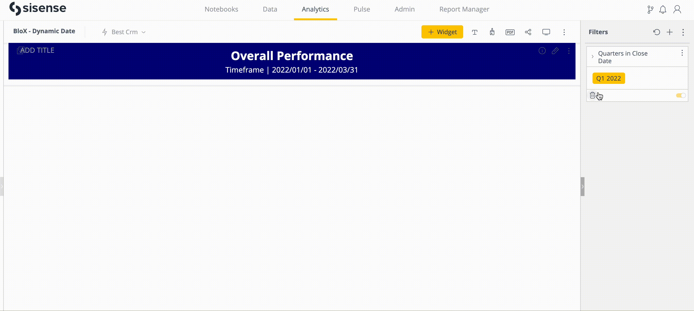

# Dynamic Timeframe in Sisense BloX
Do you need to remove confusion around the time scope on your Sisense dashboards? This post will go over how to explicitly show the start and end dates which dynamically update to reflect filter selections. 

## Analytical Need
Understanding the timeframe scope of the data is crucial for contextualizing the dashboard or report accurately. Sisense generally accomplishes this by reflecting the timeframe scope within the filter. However, there are situations when explicitly showing the scope is more clear than the date filter.

This is especially true when exporting a dashboard as a PDF. In this case, both the applied filters and the as of date need to be taken into account, which requires mental math from the PDF consumer. For example, '2023-Jan-01 to 2023-Mar-31' compared with 'Last Quarter' might seem equal. But if the report was generated in Q2 and it is now Q3, this could lead to confusion or action taken on out-of-context data. 

## The Solution
An explicit timeframe reflecting the current start and end dates of the timeframe scope is possible leveraging a data model SQL expression, BloX, and widget javascript. The gif below shows this solution in action. 



### SQL
First, we want to transform our date field into a numeric field so we can use Min() for the start date and Max() for the end date. In the SELECT statement below, the date value '2023-Jan-01' will have a date_number value 20230101.  

```
SELECT *,
  YEAR(date) * 10000 + MONTH(date) * 100 + DAYOFMONTH(date) * 1 as date_number
FROM my_table
```

### Widget
In a BloX widget, we create two values. 
Our first value is 'MIN(date_number)' which we name 'start_date'.
Our second value is 'MAX(date_number)' which we name 'end_date'.

In our BloX editor script, we use inline HTML to assign the 'blox-date-format' class to both our dates. We will use this class in our javascript to select the DOM element and customize the display of the date value.  

Note, in the number formatting of each value, the thousands seperator has been selected to omit commas.   

```
{
    "type": "TextBlock",
    "text": "️Timeframe | <span class='blox-date-format'>{panel:start_date}</span> - <span class='blox-date-format'> {panel:end_date} </span>",
    "style": {
        "text-align": "center",
        "font-size": "16px",
        "margin-top": "1px",
        "margin-bottom": "10px",
        "color": "white"
    }
}
```


### Javascript
In our BloX widget's javascript, our goal is to select the start_date and end_date DOM elements by the class we defined in the BloX editor, then modify how the values are displayed. 

Notes: If there are other DOM elements on the dashboard that share the class name used here, they will also be affected by this script. This includes duplicates of this blox widget. However, be aware that it could affect other elements on the dashboard as well.

```
widget.on('domready', function() {
	var elements = document.getElementsByClassName("blox-date-format");
	for (var i = 0; i < elements.length; i++) {
		var sep = '/'
		var pos1 = 4
		var pos2 = 6
		var dt = elements[i].innerText
		dt = dt.replaceAll('/', '').trim()
		dt = [dt.slice(0, pos1), sep, dt.slice(pos1,pos2), sep, dt.slice(pos2)].join('')
		elements[i].innerText = dt
	}
})
```

This example displays our date values with the format 'yyyy/mm/dd'. The javascript can be modified to customize the format to whatever desired format, such as 'dd - mmm - yyyy'. 

